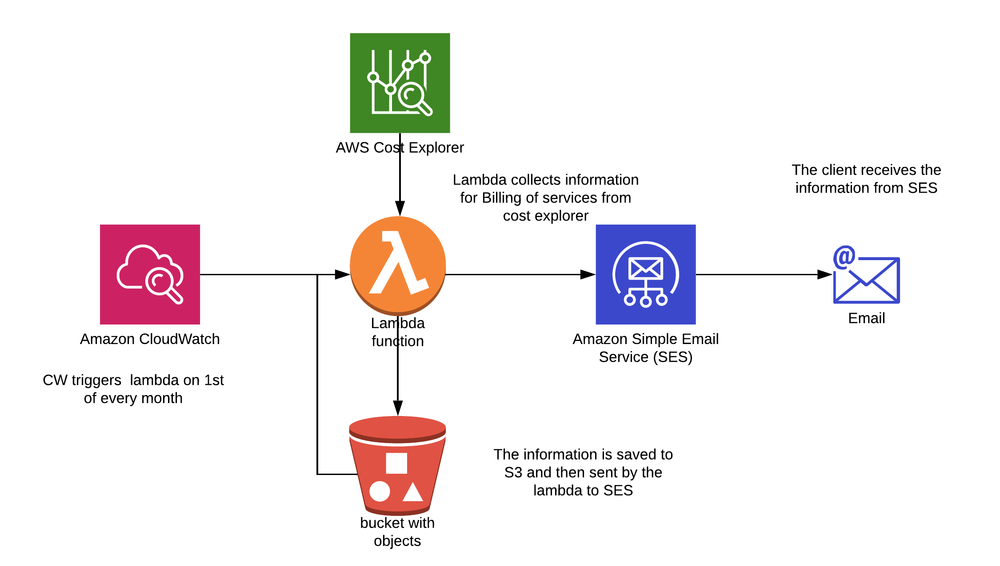

# terraform-aws-cost-explorer-monthly-billing-report
Monthly Billing Report from cost explorer transformed to csv

Invoking this module will create :
- S3 bucket, which serves storing the billing
 reports
- IAM role with policy attached, in order that the lambda has permissions to
 use S3, SES, CE services
 - CW event rule to trigger lambda function
 - Lambda to generate the report, save it to S3 and send it via SES 


## Change log
1. Version 1.00 - Initial version

## Before you begin
The SES is available in following regions:

- US East (N. Virginia)	us-east-1
- US West (Oregon)	us-west-2
- EU (Ireland)	eu-west-1

The Module should be deployed in eu-west-1 for EU customers
You should verify emails for the receiver and sender manually in SES service


## Variables
* **source** - Relative path to the module
* **client_name** - client name, should be with lowercase letters, because it is
 part of the bucket name. Bucket
 names can contain lowercase letters, numbers, and hyphens. Each label must start and end with a lowercase letter or a number.
[AWS Bucker Name Reference](https://docs.aws.amazon.com/AmazonS3/latest/dev/BucketRestrictions.html)
* **cron_job** - specify, when the job will run. cron job - (Minutes' 'Hours
' 'Day of month' 'Month' 'Day of week' 'Year)
[AWS Schedule Reference](https://docs.aws.amazon.com/AmazonCloudWatch/latest/events/ScheduledEvents.html)
* **tag_environment** - tag for naming the environment - prod, uat and etc.
* **lambda_timeout** - time for the lambda to finish the specified job in
 seconds
* **region** - region
* **ses_recipient** - the recipients of the mail
* **ses_sender** - mail sender
* **ses_subject** - subject of the message
* [ **tag_deployment_method** ] - optional, has default value of `tf`
 
## Quick start
Minimal requirements example follows. If you want to customize the creation further,
you use the modification parameters from the optional section above. 

```hcl
module "cost_explorer" {
  source = "./v1.00"
  client_name = "client"
  cron_job = "cron(0 10 1 * ? *)"
  tag_environment = "PROD"
  lambda_timeout = "300"
  region = "eu-west-1"
  ses_recipient = "example@email.com"
  ses_sender = "email@example.com"
  ses_subject = "Billing information"
}
```

###Cost Explorer

The module send cost explorer information csv file to client 
via ses every first day of the month
at 10:00 with the costs per service for last month
*SES email of the sender and receiver should be verified manually. 

**Expected outcome**:

The module creates lambda function, S3 bucket, called <"service-billing-report-CLIENT">
- CW will trigger the lambda every first day of the month at 10:00
- S3 bucket will be the container for billing report
- lambda creates the report and saves it to the s3 bucket with name cost_explorer2019-07-01.csv 
- the lambda downloads the file to /tmp/cost_explorer*.csv
- lambda send email to the client with the file attached
- the report will remain in the bucket
- A lifecycle policy could be added

### Logical scheme 


